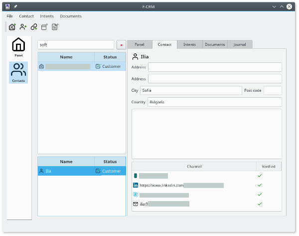

# F-CRM

**Customer Relations Management** for Freelancers and Individual Contractors.

 Screenshot from Debian Linux

# Why?
I am a freelancer. I need professional relations with my clients. This require a system where all contact-information, documents, emails, calls, - *everything* - is easily available when I need it.

# Backstory
I spent a full day trying to find a suitable solution. I looked for an open source, or at least affordable, desktop application. Nothing. Everything is *cloud* these days. It's just that - *I don't want cloud*. Cloud services are fragile. They may go tits up. They may get acquired and terminated. They may simply *terminate your service for whatever or no reason*. **There is no cloud!** It's just someone else's computer. I like dependable applications. They're faster to work with, have a richer set of UI controls, and they work whether Internet is available or not.

I did try [odoo](https://www.odoo.com/) CRM and Sales modules, installing the backed on my own server. Odoo is very popular. It's an impressive project - but the CRM capabilities are too limited for my use.

So, I decided to code a good Desktop CRM application from scratch in *one* week. One week later, Friday 23'rd 2018, I downloaded the binary .deb package from my build server, installed it on my PC, and started to use it.

# Features
The application is dead simple, with just the complexity and feature a high value Freelancer needs to do a brilliant job with sales and customer relations.

- **Contact management** (companies or private persons).
- **Contact-person management** at the companies.
- **Intents** (pipelines) - some mini-projects with clear defined goals that you want to achieve. For example , sell something to, or get the attention from, a prospect.
- **Actions** - Steps / tasks to perform to move an intent forward against completion. For example - send a follow-up mail at a specific date.
- **Document management** documents and mails are linked to customers, persons, intents or actions.
- **Journal** - a list of all the relevant things that has happened within the relation with a contact. This is updated automatically when you add or change information.
- **Data is stored locally** in a sqlite database.
- **Integration with email clients** so that we can send and look at sent/received emails directly from *f-crm*. Currently Thunderbird is tested.

# Supported platforms
 - Linux AppImage (built from Ubuntu Trusty LTS)
 - Debian Stretch
 - Debian Testing
 - Ubuntu Xenial (LTS)
 - Ubuntu Bionic (LTS)
 - macOS
 - Windows (Windows Vista and up, 64 bit builds)

# How to build
I use QT Creator for this project. There are [scripts](scripts) for building and packaging it from the command-line.

There is also a [Jenkinsfile](ci/jenkins/Jenkinsfile.groovy) and [docker-files](ci/jenkins/) to build it on all platforms from Jenkins.

# Current status
**Under active development**. I am using it myself, and will fix bugs and add nice features as other users suggest them or I discover them myself.

